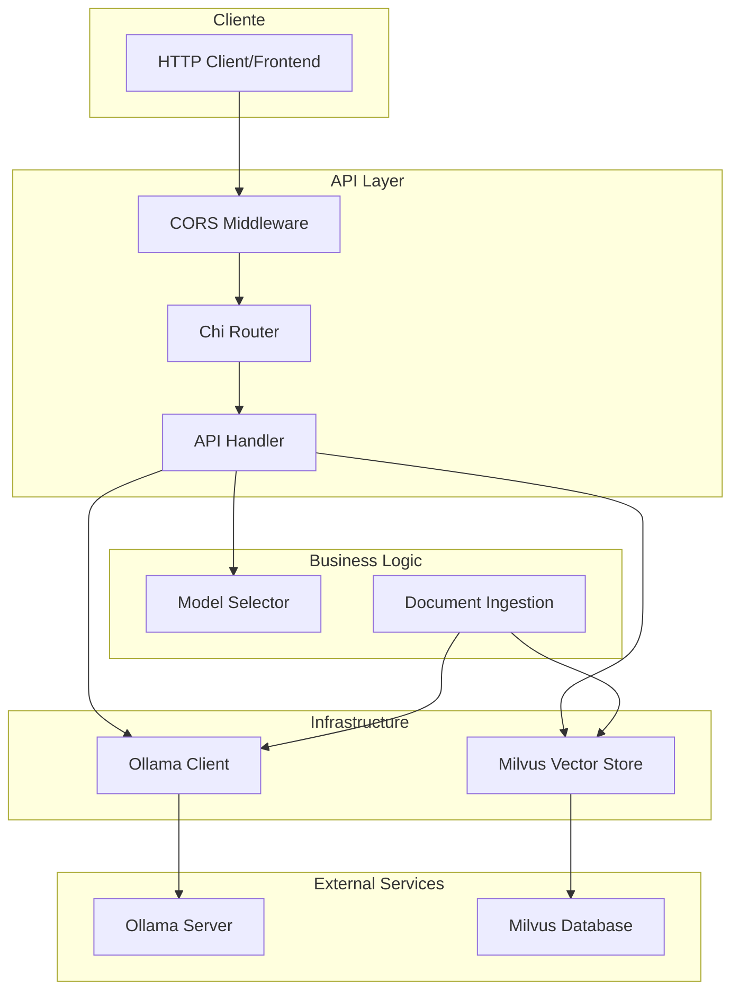
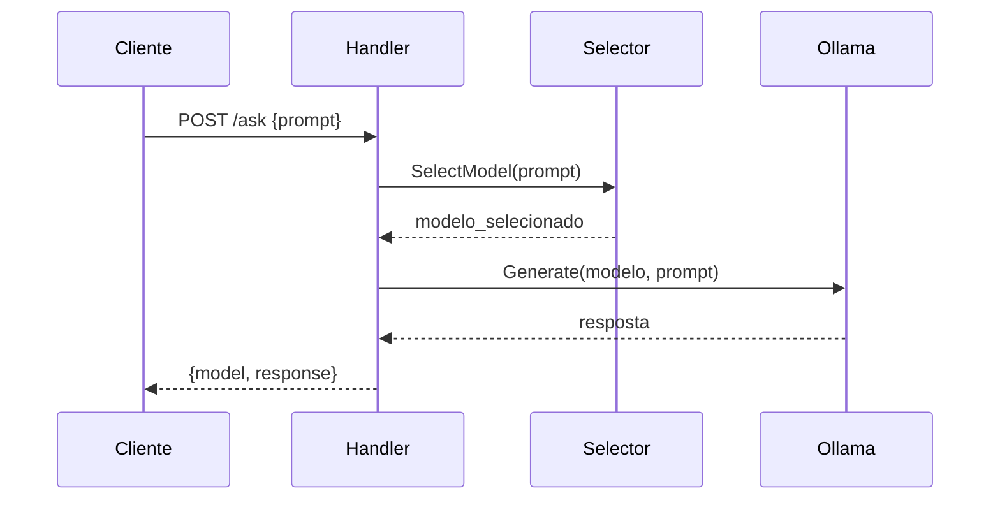
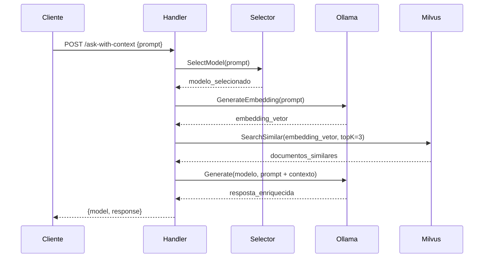
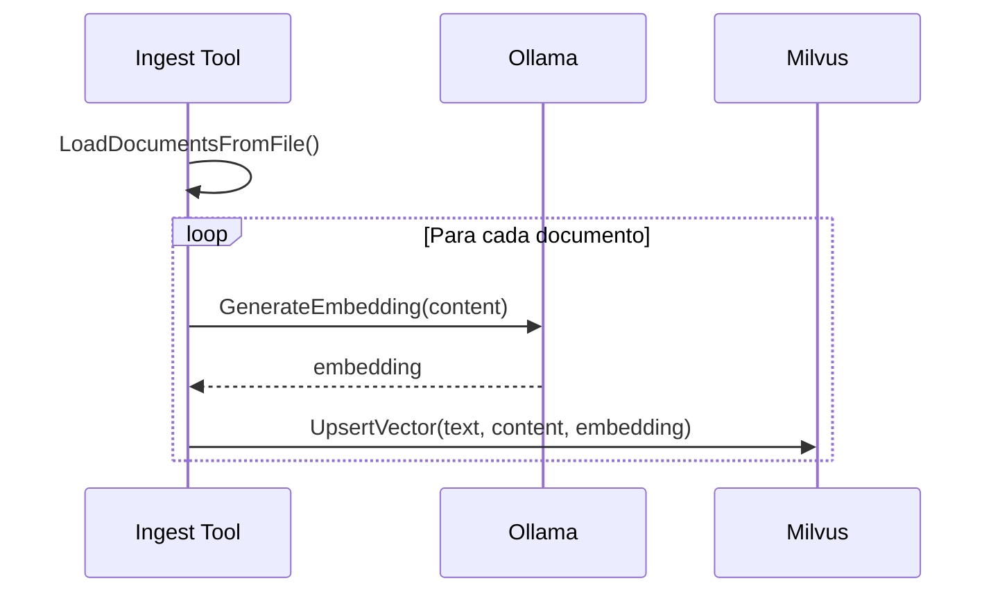

# Arquitetura de Gestão de Modelos IA via Ollama

## 🏛️ Visão Geral da Arquitetura

O sistema **Math-IA** implementa uma arquitetura moderna e modular para gestão de modelos de IA utilizando **Ollama** como servidor de modelos locais e **Milvus** como banco de dados vetorial. A arquitetura segue os princípios de **Clean Architecture** e **Domain-Driven Design**.

## 📊 Diagrama de Arquitetura Completa



## 🔧 Componentes da Arquitetura

### 1. **API Layer** (`internal/api/` & `internal/router/`)

#### Router (`router/routes.go`)
- **Responsabilidade**: Gerenciar rotas HTTP e middleware
- **Tecnologia**: Chi Router
- **Características**:
  - CORS configurado para múltiplas origens
  - Middleware de logging e erro
  - Rotas RESTful simples

```go
// Estrutura do Router
func NewRouter(ollamaClient *ollama.Client, vector *vectorstore.Milvus) http.Handler {
    r := chi.NewRouter()
    r.Use(withCORS)
    handler := api.NewHandler(ollamaClient, vector)
    r.Post("/ask", handler.Ask)
    r.Post("/ask-with-context", handler.AskWithContext)
    return r
}
```

#### API Handler (`api/ask.go`)
- **Responsabilidade**: Processar requisições HTTP e coordenar serviços
- **Padrão**: Controller Pattern
- **Endpoints**:
  - `POST /ask`: Pergunta simples sem contexto
  - `POST /ask-with-context`: Pergunta com busca semântica (RAG)

### 2. **Business Logic Layer**

#### Model Selector (`ia/selector/selector.go`)
- **Responsabilidade**: Seleção inteligente de modelos baseada no conteúdo
- **Algoritmo**: Sistema de pontuação por palavras-chave ponderadas

```go
// Algoritmo de Seleção
func SelectModel(prompt string) string {
    promptLower := strings.ToLower(prompt)
    scores := map[string]int{}
    
    // Calcula pontuação para cada modelo
    for model, keywords := range WeightedKeywordsByModel {
        for kw, weight := range keywords {
            if strings.Contains(promptLower, kw) {
                scores[model] += weight
            }
        }
    }
    
    // Retorna modelo com maior pontuação
    return bestModel
}
```

**Configuração de Modelos**:
| Modelo | Especialização | Palavras-chave (peso) |
|--------|----------------|----------------------|
| `AceMath-7B` | Matemática | integral(3), derivada(3), cálculo(2) |
| `CodeLlama` | Programação | python(3), golang(3), api(2) |
| `Llama3.1` | Geral | Modelo fallback |

### 3. **Infrastructure Layer**

#### Ollama Client (`ia/ollama/`)

**Estrutura Modular**:
```
ollama/
├── cliente.go    # Cliente HTTP base
├── generate.go   # Geração de texto
└── embeding.go   # Geração de embeddings
```

**Cliente Base** (`cliente.go`):
- HTTP client com timeout configurável
- Tratamento de erros padronizado
- Interface REST com Ollama server

**Geração de Texto** (`generate.go`):
```go
type GenerateRequest struct {
    Model  string `json:"model"`
    Prompt string `json:"prompt"`
    Stream bool   `json:"stream"`
    System string `json:"system,omitempty"`
}
```

**Geração de Embeddings** (`embeding.go`):
```go
type EmbeddingRequest struct {
    Model  string `json:"model"`
    Prompt string `json:"prompt"`
}
```

#### Milvus Vector Store (`ia/vectorstore/`)

**Funcionalidades**:
- Criação automática de collections
- Indexação vetorial (L2 distance)
- Busca por similaridade
- Operações CRUD para vetores

**Schema da Collection**:
```go
schema := &entity.Schema{
    CollectionName: "docs",
    Fields: []*entity.Field{
        {Name: "id", DataType: entity.FieldTypeInt64, PrimaryKey: true, AutoID: true},
        {Name: "text", DataType: entity.FieldTypeVarChar, MaxLength: 1024},
        {Name: "content", DataType: entity.FieldTypeVarChar, MaxLength: 4096},
        {Name: "source", DataType: entity.FieldTypeVarChar, MaxLength: 256},
        {Name: "embedding", DataType: entity.FieldTypeFloatVector, Dim: 768},
    },
}
```

### 4. **Data Ingestion** (`tools/ingest.go`)

**Pipeline de Ingestão**:
1. **Load**: Carrega documentos de arquivo JSON
2. **Embed**: Gera embeddings usando `nomic-embed-text`
3. **Store**: Armazena no Milvus com metadados

```go
type Document struct {
    ID      int64  `json:"id"`
    Text    string `json:"text"`
    Source  string `json:"source"`
    Content string `json:"content"`
}
```

## 🔄 Fluxos de Dados

### Fluxo 1: Pergunta Simples (`/ask`)



### Fluxo 2: Pergunta com Contexto (`/ask-with-context`) - RAG



### Fluxo 3: Ingestão de Documentos



## 🏗️ Padrões de Design Utilizados

### 1. **Dependency Injection**
```go
// Handler recebe dependências via construtor
func NewHandler(client *ollama.Client, vector *vectorstore.Milvus) *Handler {
    return &Handler{
        OllamaClient: client,
        Vector:       vector,
    }
}
```

### 2. **Strategy Pattern** (Model Selection)
- Diferentes estratégias de seleção de modelo
- Fácil extensão para novos algoritmos de seleção

### 3. **Repository Pattern** (Vector Store)
- Abstração da camada de dados
- Interface clara para operações vetoriais

### 4. **Factory Pattern** (Client Creation)
```go
func NewClient(baseURL string) *Client {
    return &Client{
        baseURL: baseURL,
        http:    &http.Client{Timeout: 60 * time.Second},
    }
}
```

## 🚀 Características Avançadas

### 1. **Seleção Inteligente de Modelos**
- **Algoritmo**: Sistema de pontuação baseado em palavras-chave
- **Extensibilidade**: Fácil adição de novos modelos e critérios
- **Performance**: Seleção em tempo real sem overhead

### 2. **RAG (Retrieval-Augmented Generation)**
- **Pipeline**: Embedding → Busca → Contexto → Geração
- **Qualidade**: Respostas mais precisas com contexto relevante
- **Escalabilidade**: Suporte a grandes volumes de documentos

### 3. **Gestão de Conexões**
- **Timeouts**: Configuráveis para diferentes operações
- **Retry Logic**: Tratamento de falhas temporárias
- **Connection Pooling**: Reutilização eficiente de conexões

### 4. **Monitoramento e Observabilidade**
- **Logging**: Estruturado para debugging
- **Métricas**: Tempo de resposta e taxa de erro
- **Health Checks**: Verificação de dependências

## 🔧 Configuração e Deploy

### Variáveis de Ambiente
```env
OLLAMA_HOST=http://localhost:11434
MILVUS_HOST=localhost
MILVUS_PORT=19530
```

### Inicialização da Aplicação
```go
func main() {
    // 1. Carregamento de configuração
    config := config.NewMilvusConfig(os.Getenv("MILVUS_HOST"), os.Getenv("MILVUS_PORT"))
    
    // 2. Inicialização de dependências
    milvus, _ := vectorstore.NewMilvus(config)
    ollama := ollama.NewClient(os.Getenv("OLLAMA_HOST"))
    
    // 3. Setup da base de dados
    milvus.CreateCollectionIfNotExists(ctx, "docs", 768)
    milvus.CreateIndexIfNotExists(ctx, "docs", "embedding")
    
    // 4. Ingestão inicial
    tools.RunIngest(ctx, milvus, ollama, "nomic-embed-text", "./examples")
    
    // 5. Inicialização do servidor
    r := router.NewRouter(ollama, milvus)
    http.ListenAndServe(":8081", r)
}
```

## 📈 Performance e Escalabilidade

### Otimizações Implementadas
1. **Connection Pooling**: Cliente HTTP reutiliza conexões
2. **Batching**: Ingestão em lotes para melhor throughput
3. **Indexação Inteligente**: Índices otimizados no Milvus
4. **Timeouts**: Prevenção de requests infinitos

### Métricas de Performance
- **Latência de Seleção**: < 1ms
- **Tempo de Embedding**: ~100-500ms
- **Busca Vetorial**: ~10-50ms
- **Geração de Resposta**: 1-10s (dependende do modelo)

## 🔐 Segurança e Boas Práticas

### Segurança
- **CORS**: Configurado para origens específicas
- **Input Validation**: Validação de entrada JSON
- **Error Handling**: Não exposição de detalhes internos

### Boas Práticas
- **Clean Architecture**: Separação clara de responsabilidades
- **SOLID Principles**: Interface segregation e dependency inversion
- **Error Wrapping**: Contexto de erro preservado
- **Resource Management**: Cleanup adequado de recursos

## 🚀 Extensibilidade

### Adicionando Novos Modelos
1. Baixar modelo no Ollama
2. Configurar em `selector.go`
3. Definir palavras-chave e pesos
4. Testar seleção automática

### Novos Tipos de Busca
1. Implementar interface de busca
2. Estender pipeline RAG
3. Configurar novos índices

### Integração com Outros Vector Stores
1. Implementar interface comum
2. Adapter pattern para diferentes providers
3. Configuração via environment

---

Esta arquitetura proporciona um sistema robusto, escalável e maintível para gestão de modelos de IA, combinando as melhores práticas de desenvolvimento com tecnologias modernas de AI/ML.
